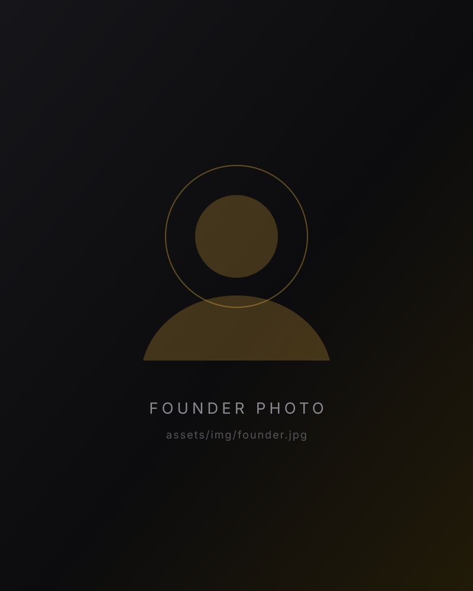

# Shine Digital — Built to Outshine

A single-page agency site. Pure HTML, CSS and vanilla JS — no build step, no dependencies.
Drop the folder on any host (Netlify, Vercel, cPanel, GitHub Pages) and it runs.

```
index.html
assets/
  css/style.css
  js/main.js
  img/logo-mark.svg
  img/founder-placeholder.svg
```

## Run it locally

Open `index.html` directly, or serve it:

```bash
npx serve .          # or: python -m http.server 8000
```

## The three things you'll want to change first

**1. Founder photo** — save the photo as `assets/img/founder.jpg`, then in `index.html` change:

```html

```
to
```html

```

A portrait crop around 4:5 works best. While you're there, replace `Founder & CEO` in the
caption with the real name and title.

**2. Contact form** — it currently validates, then hands off to the visitor's email client
(`mailto:hello@shinedigital.com.bd`). To capture submissions properly, replace the handoff in
`assets/js/main.js` (section 14) with a POST to your endpoint — Formspree, a serverless
function, whatever you use:

```js
fetch('/api/contact', { method: 'POST', body: new FormData(form) })
  .then(function () { msg.textContent = 'Thanks — we will be in touch within one business day.'; });
```

**3. Case studies** — the four cards in the `Selected work` section use gradient placeholders
(`.card__media--1` … `--4` in the CSS) and illustrative results. Swap in real client names,
real numbers, and real images when you have clearance to publish them. To use a photo,
set a `background-image` on the matching `.card__media--n::before` rule.

## Brand tokens

Everything is driven by CSS variables at the top of `assets/css/style.css`:

| Token | Value | Used for |
|---|---|---|
| `--yellow` | `#ffc244` | Primary accent, from the logo |
| `--yellow-hi` | `#ffe0a0` | Highlights and gradient sweeps |
| `--amber` | `#f2a11c` | Gradient depth |
| `--display` | Space Grotesk | Headlines |
| `--body` | Inter | Body copy |

The logo mark is inlined as SVG in the header, footer and preloader so it can be recoloured
and animated. If you'd rather use the original raster file, save it as `assets/img/logo.png`
and swap the three `<svg>` blocks for ``.

## Interactions

| Where | What happens |
|---|---|
| Load | Preloader counts up and reveals the tagline; hero headline animates in per character |
| Hero | Interactive particle constellation on canvas that reacts to the pointer; parallax fade on scroll |
| Everywhere | Magnetic buttons, custom cursor with contextual labels, cursor-tracking spotlight, scroll progress bar |
| The idea | Copy illuminates word by word, tied to scroll position |
| Services | Accordion rows with a sweep highlight; the first opens by default on desktop |
| Approach | Scroll-driven horizontal rail on desktop, swipeable snap rail on mobile |
| Work | 3D tilt on hover, image zoom, KPI badges |
| Built to Outshine | Full-bleed band that zooms in and back out as it passes through |
| Founder | Slow parallax zoom on the portrait |
| Footer | Giant OUTSHINE wordmark that scales as it enters |

All motion respects `prefers-reduced-motion`, and the heavy effects (custom cursor, canvas,
tilt, magnetic buttons) are disabled on touch devices.

## Accessibility & performance notes

- Semantic landmarks, labelled form fields, `aria-expanded` on the accordion and menu.
- The canvas pauses when scrolled out of view; particle count scales with viewport size.
- No third-party JS. The only external request is Google Fonts — self-host the two families
  if you want a zero-dependency page.
